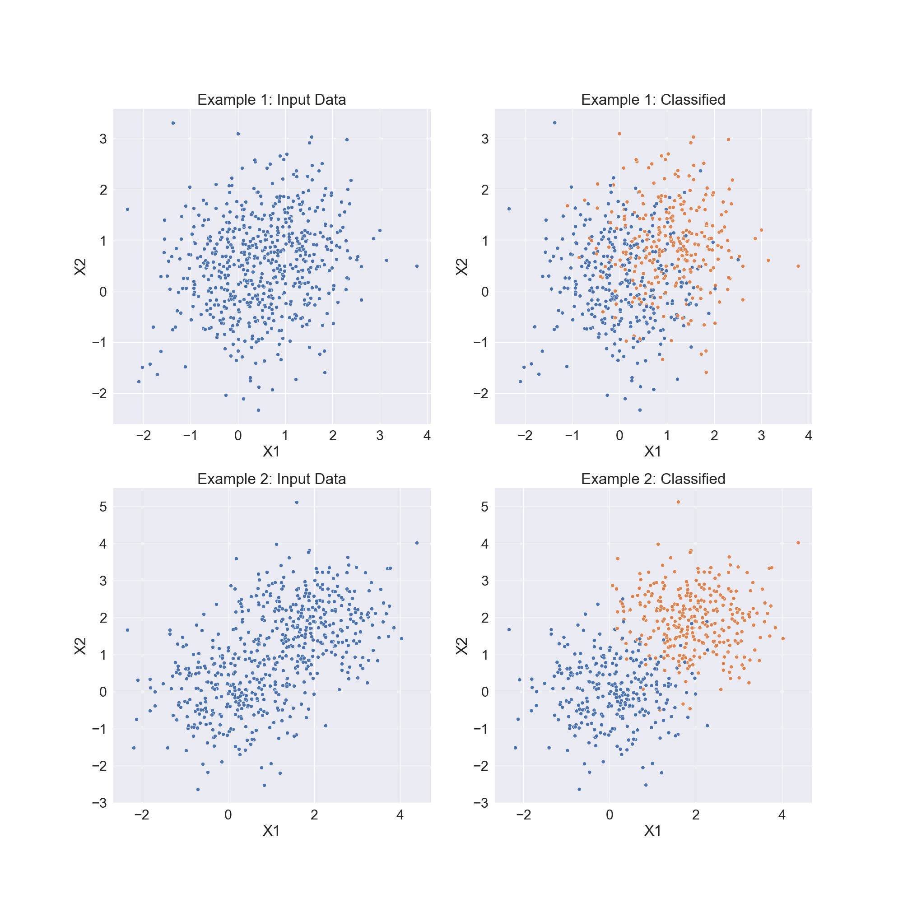

# Expectation-Maximization
 
 Implementation of the expectation–maximization (EM) algorithm in NumPy for a set of joint normal and independent distributions.



## Execution

The program can be run in the terminal as such:

```bibtex
python em.py [file] [length] [clusters] [seconds]
```

Where [file] is replaced with the name of the csv file located in the data folder, [clusters] is replaced with a integer representing the number of clusters that will divide the datapoints, and [seconds] is the time in seconds in which the algorithm can have its maximum number of iterations.    
An example of the command with values filled in:

```bibtex
python em.py example0.csv 2 15
```
